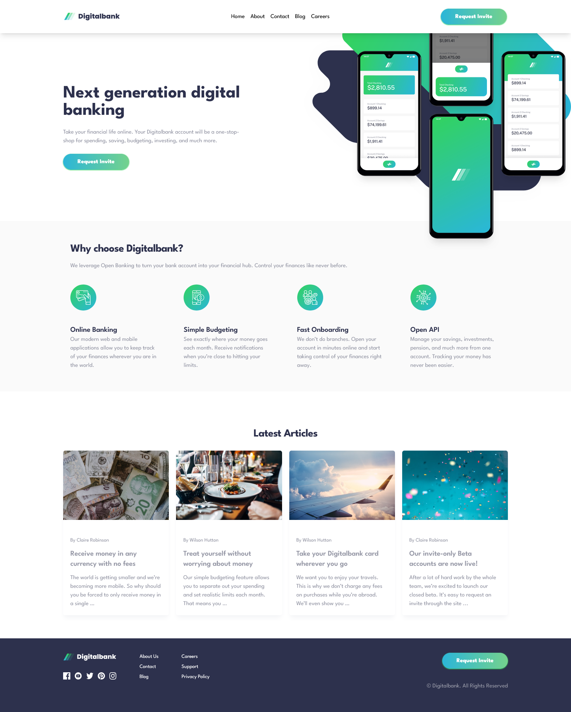
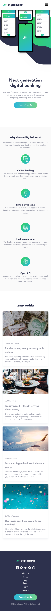
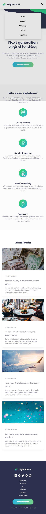
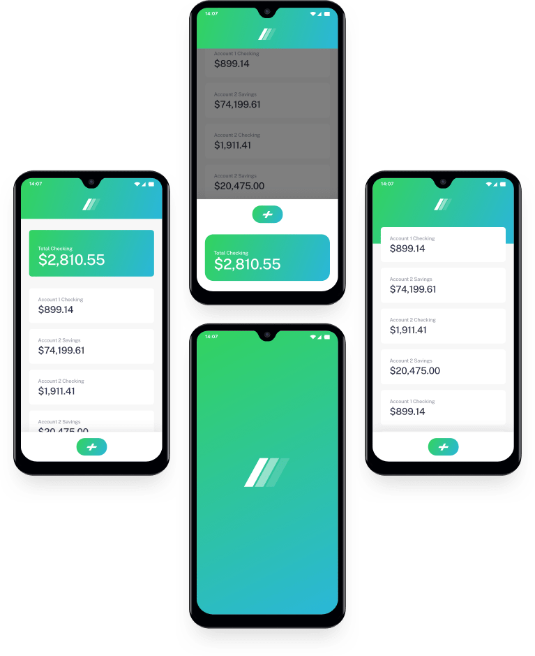

# Frontend Mentor - Digitalbank landing page solution

This is a solution to the [Digitalbank landing page challenge on Frontend Mentor](https://www.frontendmentor.io/challenges/digital-bank-landing-page-WaUhkoDN). Frontend Mentor challenges help you improve your coding skills by building realistic projects.

## Table of contents

- [Overview](#overview)
  - [The challenge](#the-challenge)
  - [Screenshot](#screenshot)
  - [Links](#links)
- [My process](#my-process)
  - [Built with](#built-with)
  - [What I learned](#what-i-learned)
  - [Continued development](#continued-development)
  - [Useful resources](#useful-resources)
- [Author](#author)


## Overview

### The challenge

Users should be able to:

- View the optimal layout for the site depending on their device's screen size
- See hover states for all interactive elements on the page

### Screenshot




### Links

- Solution URL:(https://github.com/Dev-sadeeq/Digital-Bank-Landing-Page)
- Live Site URL:(https://dev-sadeeq.github.io/Digital-Bank-Landing-Page/)

## My process

### Built with

- Semantic HTML5 markup
- CSS Grid & Flexbox
- Mobile-first workflow
- Tailwind CSS (Utility-first framework)

### What I learned

Tackling this intermediate layout taught me a lot about handling tricky absolute positioning and responsive image layering. One of the toughest parts was syncing the desktop background SVG and the phone mockups so that the background remains larger and keeps its "shooting out" effect on the left without breaking or swallowing the mockups at critical breakpoints like 768px.

Here is a snippet of how the layout container and image scaling were locked in to maintain their proportions:

```html
       <div class="relative max-md:order-1 z-0 w-full md:absolute md:top-0 md:right-0 md:w-[min(760px,60vw)] md:max-w-none md:overflow-visible">
        
        
        
        </div>
```
I also learned how to implement a bulletproof mobile menu overlay with full background scroll locking across mobile and desktop browsers by toggling overflow states on both html and body:
```js

  document.documentElement.classList.add('overflow-hidden');
  document.body.classList.add('overflow-hidden');
```

### Continued development

Moving forward, I want to continue sharpening my mastery of complex CSS layouts, precise responsive alignment using modern CSS features, and refining UI/UX micro-interactions for mobile navigation states.

### Useful resources

- [TailwindCSS Documentation](https://tailwindcss.com/docs) - Essential for quickly styling responsive layouts and positioning layers.
- [The Markdown Guide](https://www.markdownguide.org/) - Helpful for structuring documentation

## Author

- Frontend Mentor - [@Dev-sadeeq](https://www.frontendmentor.io/profile/Dev-sadeeq)
- Twitter - [@Dev_sadeeq](https://www.twitter.com/Dev_sadeeq)
